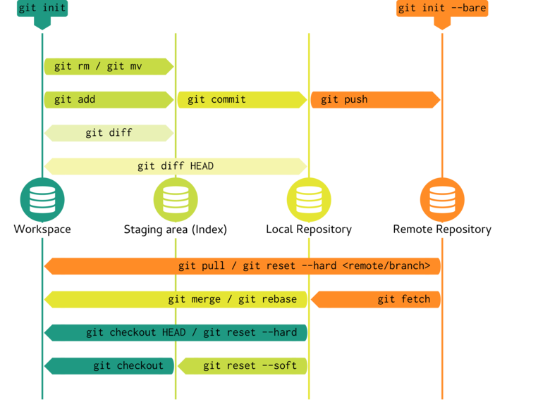
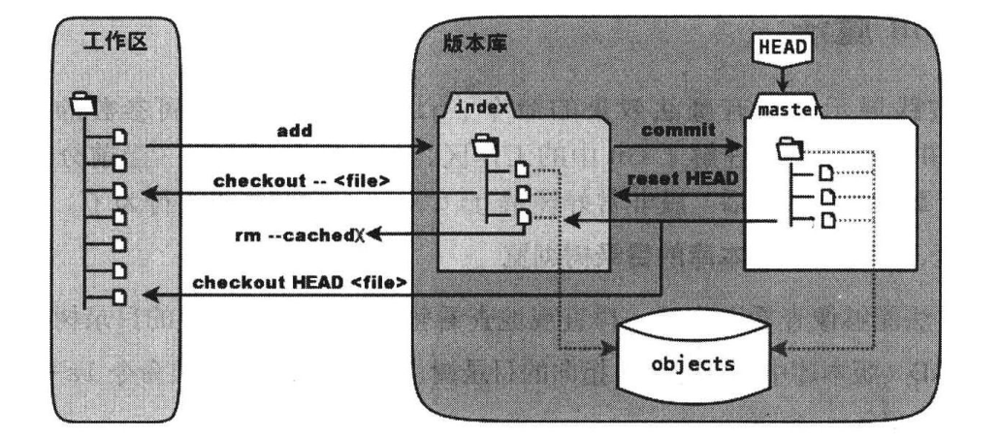

# Git 笔记

## 预备

`diff` 命令逐行比较两个文本文件或目录的差异。若将 `diff` 的输出重定向到文件中，可用该文件恢复原文件或目标文件。

```shell
diff file1 file2 > diff.txt
# 恢复file1
patch file2 < diff.txt
# 恢复file2
patch -R file1 < diff.txt
```

> `diff` 描述两个文件不同的方式是告诉我们怎么样改变第一个文件之后与第二个文件匹配，方式包括 add，change，delete。

## 配置

### 查看 git 版本

```shell
git --version
# git version 2.17.1
```

### config 三个等级的配置文件

```shell script
# 工程级，`${workpace}/.git/config`
git config -e
# 全局级（用户主目录），`/home/${user}/.gitconfig`
git config -e --global
# 系统级，`/etc/gitconfig`
git config -e --system
```

其优先级依次降低

### 一些常用的`config`

```shell script
# 配置用户信息
git config --global user.name "username"
git config --global user.email "email"
# 配置alias
sudo git config --system alias.st status
sudo git config --system alias.ci commit
sudo git config --system alias.co checkout
sudo git config --system alias.br branch
# 设置中文输出
git config --global core.quotepath false
# 开启颜色显示
git config --global color.ui true
```

## 查看状态

### `git status`

`git status -s`精简的状态输出
输出第一列是 stage 和版本库的差异
输出第二列是工作区和 stage 的差异

### `git diff`

- 对比工作区和暂存区(stage)的区别

```shell script
git diff
```

- 对比工作区和`HEAD`的区别

```shell script
git diff HEAD
```

- 对比暂存区(stage)和版本库的差异

```shell script
git diff --cached #or git diff --staged
```

### `git log`

查看 branch 的详细信息，可接不同的参数，效果不一样。

一个`commit`包含三个哈希值： `commit` 提交的唯一标识，`tree` 提交对应的目录树，`parent` 父提交的标识，可能有多个。

### `git reflog`

`git reflog` 可以查看所有分支的所有操作记录（包括已经被删除的 commit 记录和 reset 的操作）

### `git rev-parse`

这是一个比较底层也相对复杂的命令。

```shell script
# 显示分支
git rev-parse --symbolic --branches
# 显示里程碑
git rev-parse --symbolic --tags
# 显示对应的 SHA-1 值
git rev-parse HEAD
```

> HEAD^ 与 HEAD～ 的区别
> 因为 commit object 可能有多个父提交，回退时可以选择
> ^ 表示回退的方向，从 1 开始
> ~ 表示回退的步数，若有多个父提交，默认 1 方向

### `git bisect`

### 忽略文件

若将某些文件不纳入 Git 的管理，即不出现在 untracked 文件列表，可以创建一个名为 .gitignore 的文件，列出要忽略的文件模式

文件 .gitignore 的格式规范如下：

- 所有空行或者以 ＃ 开头的行都会被 Git 忽略。
- 可以使用标准的 glob 模式匹配。
- 匹配模式可以以（/）开头防止递归。
- 匹配模式可以以（/）结尾指定目录。
- 要忽略指定模式以外的文件或目录，可以在模式前加上惊叹号（!）取反。

 使用两个星号表示匹配任意中间目录

## 更新



### `git add`

工作目录下文件分为已跟踪或未跟踪， 而已跟踪的文件也有多种状态。


使用 `git add` **追踪新文件** 或 **更新文件变化到暂存区**

```shell script
git add [file1] [file2] ...
# 把所有已追踪的文件的修改或删除添加到 stage
git add -u
```

### `git rm`

从 Git 中移除某个文件，就必须要从已跟踪文件清单中移除（确切地说，是从暂存区域移除），然后提交。根据 Git 的特性，被移除的文件并不是真的消失。

```shell script
git rm file1 file2 ...
```

参数：

- -f: 删除之前修改过且已 stage 的文件

- --cached: 停止追踪但不从本地删除，适用于误追踪的文件

### `git commit`

`git commit` 主要是将暂存区里的改动给提交到本地的版本库，每个 commit 都有一个 40 位的哈希值，可以通过该值定位到该次提交。

常见参数：

- -m message: commit 强制要求 message，以对该次 commit 进行说明，若无该参数，则会进入编辑器输入 message.

- -a: 相当于在 commit 前执行了 `git add -u`，即 untracked 的文件不被提交。

- --amend: 合并 stage 和最近的一次 commit, 然后用生成的新的 commit 替换掉老的. 如果缓存区没有内容, 则用于修改上一次 commit 的描述。

### `git reset`

```shell script
# 用法一
git reset [-q] [<commit>] [--] <path> ...
# 用法二
git reset [--soft | --mixed | --hard | --merge | --keep] [-q] [<commit>]
```

用法一（包含路径名）是用指定提交状态（`<commit>`）的文件来替换暂存区中的文件，无额外作用。

用法二（无路径名）则会重置引用，不同的参数的效果不同：

- hard: 回退到指定状态（`<commit>`）下，同时刷新工作区和 stage.

- soft: 回退到指定状态，不刷新工作区和 stage.

- mixed: 默认，回退到指定状态，只刷新 stage.

显然，后两者不会撤销当前工作区的修改。

## 分支

### `git branch`

```shell script
# 查看本地所有分支
git branch
# 查看远程所有分支
git branch -r
# 查看本地和远程的所有分支
git branch -a
# 新建分支
git branch <branchname> 
   # 删除分支
git branch -d <branchname>
# 重命名分支
git branch -m <oldbranch> <newbranch>
```

### `git fetch`

```shell script
# 若不指定分支名，则拉取全部
git fetch [<远程主机名>[<分支名>]]
```

执行完后需要执行 `git merge`，取回的更新，要使用 `远程主机名/分支名` 形式读取。

### `git merge`

```shell script
git merge [选项 ...] <commit> ...
```

合并的大多情况，只需提供一个 `<commit>`作为参数。
合并操作将 `<commit>` 对应的目录树和当前分支的目录树进行合并，合并后的提交以当前分支的提交作为第一个父提交，以 `<commit>` 作为第二个父提交。


### `git push`

`git push` 命令用于将本地分支的更新，推送到远程主机。

```shell script
git push [-u] [<远程主机> <本地分支名>:<远程分支名>]
```

说明：

- 冒号前后是必须没有空格的
- 如果省略远程分支名，则远程分支名与本地分支名同名
- 如果省略本地分支名，则表示删除指定的远程分支
- u 参数设置追踪分支
- 2.0 版本之后 push.default 是 simple，决定 git push 的默认行为

> push.default 有以下几个可选值：
>
> - nothing  - push操作无效，除非显式指定远程分支
> - current  - push当前分支到远程同名分支，如果远程同名分支不存在则自动创建同名分支。
> - upstream - push当前分支到它的upstream分支上（这一项其实用于经常从本地分支push/pull到同一远程仓库的情景，这种模式叫做central workflow）。
> - simple   - simple和upstream是相似的，只有一点不同，simple必须保证本地分支和它的远程upstream分支同名，否则会拒绝push操作。
> - matching - push所有本地和远程两端都存在的同名分支。

### `git checkout`

三种用法

```shell script
# 不改变 HEAD,用指定（ index 或版本区）文件覆盖工作区
git checkout [-q] [<commit>] [--] <paths> ...
# 第二种主要用于切换分支，省略 <branch> 则是进行检查
git checkout [<branch>]
# 第三种创建和切换到新的分支
git checkout [-m] [[-b|--orphan] <new_branch>] [<start_point>]
```

示例：

- `git checkout branch`
   检出到`branch`分支

- `git checkout`
   显示工作区、index和HEAD的差异

- `git checkout -- filename`
   用`index`内容来覆盖工作区

- `git checkout branch -- filename`
   用`branch`分支的内容覆盖工作区

- `git checkout -- .`
   暂存区内容覆盖工作区

### `git stash`

stash 命令可用于临时保存和恢复工作区和 stage，可跨分支。

```shell script
# 保存当前工作进度
git stash
# 显示保存的进度列表
git stash list
# 恢复进度，若无参数，则恢复最新，并从工作列表上删除。
git stash pop [--index]
```

### `git cherry-pick`

### `git rebase`

将指定范围的提交“嫁接”到另一个分支上。

```shell script
git rebase --onto <new-branch> <since> <till>
```

过程：

1. `git checkout` 到 `<till>` 上
2. 将 `<since>...<till>` 的提交临时保存，左开右闭。
3. 将当前分支强制（`git reset --hard`） 到 `<newbase>`
4. 从临时保存的提交重新提交到重置之后的分支上。
5. 若提交已有，则跳过；若冲突则暂停，等待解决（`git rebase --continue`）

## 原理

### stage



暂存区（stage）使用 `.git/index` 文件保存状态。该文件实际上是一个包含文件索引的 tree object，记录了文件名和文件状态信息，如时间戳和文件长度等，但并没有包含文件内容，后者是存在 blob object.

### Git 对象

Git 是一个内容寻址文件系统。简单的说，Git 把文件的每一个版本的文件存储为 blob 文件，但这并不意味着，在修改文件后会重复存储，而是在底层优化。

Git 对象包含三种：blob object、tree object 和 commit object。

#### blob object

数据对象是文件的内容，不包括文件名、权限等信息。Git会根据文件内容计算出一个hash值，以hash值作为文件索引存储在Git文件系统中。

#### tree object

树对象包含了一条或多条树对象记录（tree entry），每条记录含有一个指向数据对象或者子树对象的 SHA-1 指针，以及相应的模式、类型、文件名信息。

#### commit object

提交对象保存了提交时的树对象指针、提交的相关信息和父提交对象指针。

一个典型的 Git 对象关系如下。


### refs/heads

每次 `git add` 都会更新存储在 stage 的 tree object，而当 `git commit` 时，会产生一个 commit object，该 object 存储指向当前 stage 的 tree object 的 SHA-1 指针 和
指向 HEAD 所指向的 commit object 的 SHA-1 指针，同时更新 HEAD 的指向为当前 commit object。

Git 使用分支最新的 commit object 的哈希值来表示一个分支，而该值存储在 `.git/refs/heads/` 文件夹。
`.git/HEAD` 文件内容一般都是分支头的引用，当然也可以手动更改为 commit object 的 SHA-1 指针，不过这样就变成了 detached HEAD，此时提交的内容不再反映在分支上，且易丢失。
