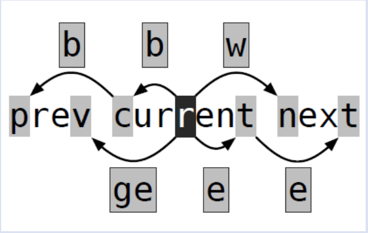

# vim 教程 摘要

## 快速入门

### 发展概述

* `vi` 是 *nix 操作系统下最基本的文本编辑器，伯克利大学的 Bill Joy 研究开发

* `vim` 由Bram Moolenaar 研发，开始是 vi 模拟器，即 Vi Imitation，后面被移植到了 Unix 和 Dos 上，重命名为 Vi Improved

* `gvim` 是 vim 的图形前端，是跨平台的编辑器

### 基本模式

* Normal 模式， 启动 vim 时就工作于 normal 模式，输入的每一个字符会被当做一个命令，主要功能就是控制屏幕光标的移动、进行文本的删除、复制等文字编辑工作

* Insert 模式, 在光标处插入文本，此时键盘输入什么就在屏幕上显示什么

* last line mode(命令模式)，主要用于保存文件或者退出vim，也可以设置编辑环境和一些编译工作，比如列出行号、查找字符串等

## 常用命令

### 移动光标

在 Normal 模式和 Insert 模式下，可使用上下左右移动光标，以下介绍 **Normal 模式**下其他移动光标的命令

* `h` 表示向左移动光标，用 `j` 表示向下移动光标，用 `k` 表示向右移动光标，用 `l` 表示向右移动光标

* `$` 命令将光标移动到当前行的行尾，与 `<End>` 作用相同，前面可以接一个计数，如`1$`表示当前行的行尾，`2$`下一行行尾，以此类推

* `^` 命令将光标移动到当前行第一个**非空字符**, 0 则是移动到当前行的第一个字符

* 单词跳转的命令前也可以接计数，表示多次行为

* `gg` 跳转第一行行首，`G` 跳转尾行行首，`行号G` 跳转到该行号对应行的行首

* `50%` 跳转文件中间位置，也可以使用其他数字


| 命令 | 光标动作 |
|----|----|
| `w` | 正向移动到下一单词的开头|
| `b` | 反向移动到当前单词/上一单词的开头|
| `e` | 正向移动到当前单词/下一单词的结尾|
| `ge`| 反向移动到上一单词的结尾|



***

vim区分 `word` 与 `WORD`,使用小写的 `w,b,e,ge`进行 **word** 间跳转，后者使用大写的字母进行跳转

* A WORD is always delimited by whitespace.

* A word is delimited by non-keyword characters, which are configurable. Whitespace characters aren't keywords, and usually other characters (like ()[],-) aren't, neither. Therefore, a word usually is smaller than a WORD; the word-navigation is more fine-grained.

***

vim 区分**实际行**和**屏幕行**，文件按照换行符分割实际行，但限于屏幕大小，一个实际行可以分为多个屏幕行。上面的移动操作都是针对实际行，有时我们需要在屏幕行上操作，vim也提供了相应操作，即在对应操作前加 `g`

例如，j 和 k 命令会根据实际行向下及向上移动，而 gj 和 gk 则是按屏幕行向下及向上移动，其他操作也类似

### 字符和单词搜索

#### 字符搜索

* `f` 接字符表示在**当前行**右向搜索，`F` 则是左向搜索

* 查找下一个 `；`, 返回上一个 `,`

* `t` 与 `f` 含义类似，区别是光标停留在被搜索字符的前一个位置

* `%` 搜索与当前光标停留的括号相匹配的另一个括号的位置，并跳转

#### 文本搜索

* `/` 接字符串表示搜索字符串在文档的位置，若要搜索单词，则`/\<word\>`，`\<`表示匹配一个单词的开头，而`\>`则表示匹配一个单词的结束

* `/` 命令是可以使用正则, 使用`n`搜索下一个, `N`搜索上一个

### 操作文本内容

常见的操作

* `d` 是 delete 的首字母，后跟一个位移命令，将删除从当前光标起点到位移的终点处(不包括终点处)的文本内容

* `c` 与 `d` 类似，区别在于执行完成后进入 Insert 模式

* `x` 命令删除当前光标的字符, 可以理解为 `dl`, `X`删除光标前一个字符，即 `dh`

* `D` 表示删除到行尾，即 `d$`

* `s` 表示删除当前字符并进入 Insert 模式，即`cl`

* `r` 命令后面接一个字符，表示用该字符替换当前字符

* `R` 进入替换模式

* `dd` 表示删除当前行

此类命令有一个固定的模式：操作符命令+位移命令，位移命令为上节所述

### 重复操作

使用`.`命令重复上次操作

### 常用编辑命令

Normal 模式下删除的文本被保存下来了, 但不是保存到Windows的剪贴板

`p` 命令表示粘贴，`y`表示复制

如果被保存的是整行，则粘贴到下一行，否则从光标后面位置粘贴

`P` 命令与 `p` 相似，区别是粘贴位置在光标前或上一行

`np` 表示粘贴n次

`y4w` 表示复制4个 word ,如果不想复制空白，则 `y4e`

### visual 模式

在 Normal 模式键入 `v` 进入 visual 模式，即可视模式

`hjkl`、`g`命令表示光标移动的命令在这里都是可用的

### 文本对象

`aw` 表示一个文本对象，`daw` 删除光标所在单词和后面的空格， `diw`不删除后面空格
`as` 表示一个句子对象，`das` 删除光标所在句子和后面的空格， `dis`不删除后面空格

## 最常用的一些操作

### last line mode 常见操作

* :e filename 打开编辑一个文件
* :w filename 保存文件
* :sav filename 另存为
* :enew  新建
* :set filetype= 设置文件类型
* :set background= 设置背景色
* :split 分割窗口 :vsplit 水平分割
* `:only` 关闭其他窗口
* `:set number` 显示行号， `:unset nonumber` 取消显示行号

## 常用的批量操作

寄存器录制宏

* 输入 `q{寄存器}` 开始录制，寄存器名为a至z的一个字母

* 执行操作

* 输入 `q` 结束录制

使用宏 `n@x`，其中n表示重复次数，x表示存放宏的寄存器

输出宏命令内容 `"xp`，其中x是宏所在寄存器

### 查找和替换

批量的查找和替换: `:s/查找字符/替换字符/[可选的修饰符]`

可选的修饰符，常用的有：g 表示替换该行所有的符合的目标字符串， p 表示列印， c 表示每次执行替换的时候都需要请求确认

默认查找光标所在行，可以在命令前添加 `行号、%、$`来更改查找范围

* `.` 表示当前行
* `%` 表示每一行
* `$` 表示最后一行
* 范围之间用`,`分割

举例：

```shell
:s/查找内容/替换内容/    #默认查找光标所在行，并替换该行第一次匹配到的内容  
:%s/查找内容/替换内容/   #则查找的是全部行，  
:$s/查找内容/替换内容/   #查找最后一行  
:5s/查找内容/替换内容/   #查找第五行  
:5,$s/查找内容/替换内容/  #查找第五行到最后一行  
```

更多可参考[博客](https://www.cnblogs.com/logsharing/p/8182920.html)

### 全局命令

`:g` 命令是全局命令，允许我们找到某个匹配模式的行然后将命令作用到它上面

```shell
:[范围参数]g/{模式}/{可执行的 vim 命令}
```
